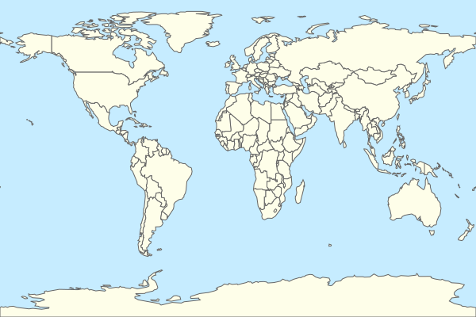
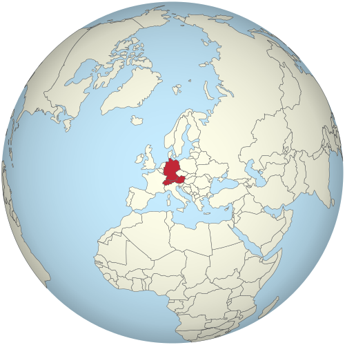
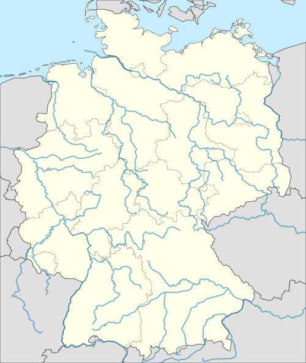

# GeoFeatureViz

**Author**: [Adrian Kühn](mailto:adrian-kuehn@posteo.de)

**GeoFeatureViz** is a Python library for visualizing geographical features such as countries, rivers, or mountains. In particular, you can:
- Load geospatial datasets (e.g., from [NaturalEarth](https://www.naturalearthdata.com/) or the [Overpass API](https://wiki.openstreetmap.org/wiki/Overpass_API) for [OpenStreetMap](www.openstreetmap.org) data)
- Preprocess geographical data to make it ready for your visualization
- Create geographical maps, especially as Scalable Vector Graphic (SVG)

Since I mainly use it to create Wikipedia-style geographical maps of features that I want to memorize using the flashcard spaced-repetition program [Anki](https://apps.ankiweb.net/), there is additional functionality to:
- Customize the map style (e.g., Wikipedia-style color themes)
- Connect to a local Anki collection

## Setup
All source code is written in Python. For usage, you have to install the package from source.

Executable scripts are either Python scripts or Jupyter notebooks. For a better separation from the core library, I created a sub-package called **geofeatureviz-scripts** that provides utils that are only used for execution (e.g., loading data), which will be explained later.

### Installation
First, clone the repository and navigating into the project:
```bash
git clone git@github.com:Adsesaft/geofeatureviz.git
```
and then navigate into the project directory:
```bash
cd geofeatureviz
```

To install **GeoFeatureViz** I recommend using [uv](https://docs.astral.sh/uv/) (see the [official instructions](https://docs.astral.sh/uv/getting-started/installation/) for how to install **uv**). When **uv** is installed, you can run:
```bash
uv sync --no-dev
```

This installs the package and all dependencies (which are defined in [pyproject.toml](pyproject.toml)) into a new virtual environment (*.venv*). To use this environment and **GeoFeatureViz**, you can either conveniently use **uv**, e.g.:
```bash
uv run python -c "from geofeatureviz.io import helpers; print(helpers.get_top_directory())"
```

or first activate the environment and then run a command, e.g.:
```bash
source .venv/bin/activate
python -c "from geofeatureviz.io import helpers; print(helpers.get_top_directory())"
```

**Note:** Alternatively to **uv**, you can use **pip** for installation. Again, navigate into the project directory, make sure that you use the **pip** in the environment you want to use, and run:
```bash
pip install .
```

If you want to run the scripts for creating maps provided in this project, you additionally have to install **geofeatureviz-scripts**, which I recommend to do. The installation is managed using **uv**, defining it as a member of the main package and providing an additional *pyproject.toml* inside the scripts folder. For installation, from the project root, simply run:
```bash
uv sync --all-packages
```
This installs *geofeatureviz-scripts* into the same virtual environment, so that you can import it with `import geofeatureviz_scripts`.

### Additional Tools
In addition to Python, external tools are used for specific tasks.

#### SVGO
With **GeoFeatureViz**, you can create SVG-files as output. These files can be optimized by removing redundant information, metadata, and other things that take up disk space, without an impact on the visual output. One tool to do so is the Node.js library [SVGO](https://github.com/svg/svgo), which can be used as command-line tool. **GeoFeatureViz** works without **SVGO**, but if you want to be able to save optimized SVG-files (with the flag `optimize=True` when saving a canvas), you have to install it by running
```bash
npm install -g svgo
```
Note: [Node.js](https://nodejs.org/) has to be installed for that, (e.g. with `sudo apt install nodejs npm`).


### Development Setup
For developers, additional tools (e.g. for linting, testing, etc.) have to be installed. Instead of running `uv sync --no-dev` for installation, developers should run
```bash
uv sync
```
to install the package, the dependencies, and the developer dependencies.

#### Dependency Management
I manage dependencies using [uv](https://docs.astral.sh/uv/). The [lock-file](uv.lock) is added to the repository.

#### Pre-Commit Hooks
I use [pre-commit](https://pre-commit.com/) to set up Git hooks for development. The hooks are defined in [.pre-commit-config.yaml](.pre-commit-config.yaml). Besides some standard hooks, the most important ones are:
- [Ruff](https://docs.astral.sh/ruff/) for linting and formatting
- [mypy](https://mypy-lang.org/) for static type checking
- [nbstripout](https://github.com/kynan/nbstripout) for stripping output from Jupyter notebooks to exclude outputs from Git

The hooks can be installed by running:
```bash
uv run pre-commit install
```

When the pre-commit hooks are installed, you should run them once on the whole project to ensure that there are no current problems:
```bash
uv run pre-commit run --all-files
```

#### Pytest
I use [pytest](https://docs.pytest.org/en/stable/) for testing. To execute all test, you can run:
```bash
uv run pytest
```
## Usage
The repository contains source code that is intended to be used like a library and some example scripts. Here, I will show a first example usage on how a map of all countries in the world can be created.

### Loading Datasets
Since datasets can become very large, they are generally not part of this repository. Some datasets have to be download from [NaturalEarthData](https://www.naturalearthdata.com/) and moved into the [raw data folder](data/raw/); others can be created by running a script. This table gives an overview over the datasets that are used throughout this project and how they can be obtained:

| Dataset File                        | Description                        | Acquisition                                                                            |
|:------------------------------------|:-----------------------------------|:---------------------------------------------------------------------------------------|
| ne_10m_admin_0_countries.zip        | Countries (detailed)               | https://naturalearth.s3.amazonaws.com/10m_cultural/ne_10m_admin_0_countries.zip        |
| ne_110m_admin_0_countries.zip       | Countries (simplified)             | https://naturalearth.s3.amazonaws.com/110m_cultural/ne_110m_admin_0_countries.zip      |
| ne_10m_admin_1_states_provinces.zip | States and Provinces               | https://naturalearth.s3.amazonaws.com/10m_cultural/ne_10m_admin_1_states_provinces.zip |
| ne_10m_rivers_lake_centerlines.zip  | Global rivers and lake centerlines | https://naturalearth.s3.amazonaws.com/10m_physical/ne_10m_rivers_lake_centerlines.zip  |
| ne_10m_rivers_europe.zip            | Europe-focused rivers              | https://naturalearth.s3.amazonaws.com/10m_physical/ne_10m_rivers_europe.zip            |
| osm_10m_rivers_germany.geojson      | Germany rivers                     | scripts/data_creation/rivers_data_creation.ipynb                                       |

You can use **GeoFeatureViz** to conveniently load these dataset. They will be returned as a [GeoPandas](https://geopandas.org/en/stable/) `GeoDataFrame`, having a lot of functionality for geographical data (e.g. here a simple plot with Matplotlib).

```python
from geofeatureviz.io import loader

countries_raw = loader.load_dataset(
    feature="country",
    source="ne",
    resolution=110
)
countries_raw.plot()
```

### Preprocessing Datasets
**GeoFeatureViz** offers functions to preprocess the datasets, especially for later visualization and export as SVG file. For example, you can directly obtain a clean dataset that can later be used more conveniently in the visualization functions by running:

```python
from geofeatureviz_scripts import loader

countries = loader.load_and_prep_data(
    feature="country",
    source="ne",
    resolution=110
)
countries.plot()
```

### Creating SVG files
A scalable vector graphic has many advantages over normal image files like JPG or PNG when visualizing geographical maps. Instead of saving pixel color values, the location of shapes (vectors) on a canvas are saved, which can then be rendered to have a high quality image, which is resizable without any loss of quality. **GeoFeatureViz** offers the functionality to create maps as such scalable vector graphics, based on [svg.py](https://github.com/orsinium-labs/svg.py).

```python
from geofeatureviz_scripts import loader
from geofeatureviz.io import path_settings
from geofeatureviz.rendering import COLORS, MapSVG

# load preprocessed countries and simplify the geometries
countries = loader.load_and_prep_data(
    feature="country",
    source="ne",
    resolution=110,
)
countries.geometry = countries.geometry.simplify(tolerance=0.2, preserve_topology=True)

# create a canvas to draw a map to
canvas = MapSVG(width=600, height=400)

# add a background covering the whole canvas, defaults to a blue ocean color
canvas.add_background(COLORS["lake"])

# draw countries in the GeoDataFrame to the map
canvas.add_gdf(countries, "Countries", fill=COLORS["land"], stroke=COLORS["border"])

# save the svg file
canvas.save(path_settings.results_dir / "examples" / "world_map.svg", optimize=True)
```
Output:



### Other Usages
The whole library contains the following modules, where some have not been shown in the example usage:
```
geofeatureviz
├── data
│   ├── anki_connector.py
│   ├── config.py
│   ├── datasets.py
│   ├── loader.py
│   ├── preprocessor.py
│   └── river_preprocessor.py
├── helpers.py
├── map_style.py
├── projections.py
└── svg_handler.py
```
All modules contain a documentation, to which you can refer if you want to use them.

## Examples
With **GeoFeatureViz**, you can create different kinds of maps for different kinds of geographical data. In the [scripts folder](scripts), there are notebooks that show how to create awesome SVGs for geographical maps. Here are some examples:

**Orthographic Projection with Marked Region**



**German Rivers**



and many more!

## Note

This project has only been used and tested on Ubuntu 24.04 LTS.

## License

This project is licensed under the MIT License.
